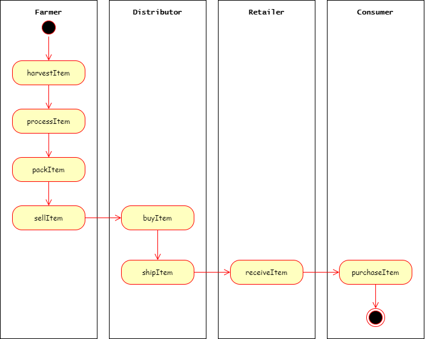
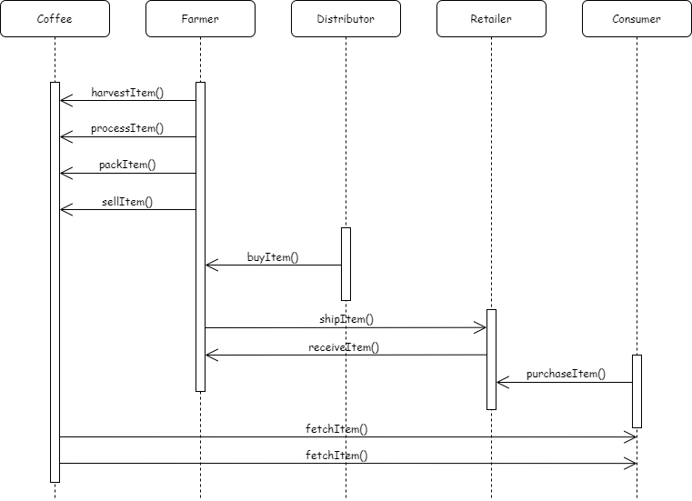
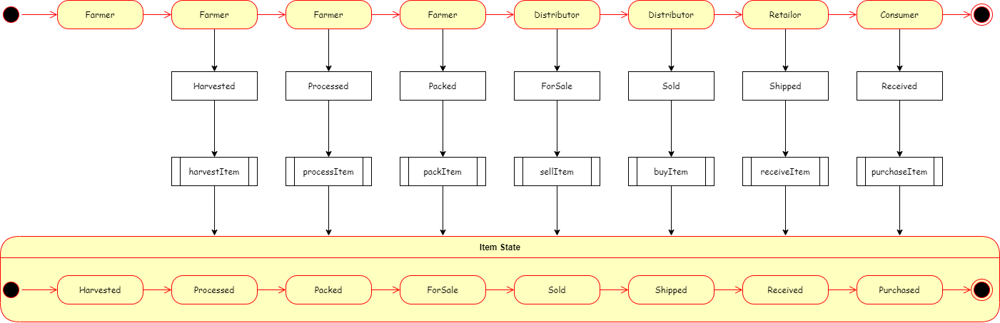
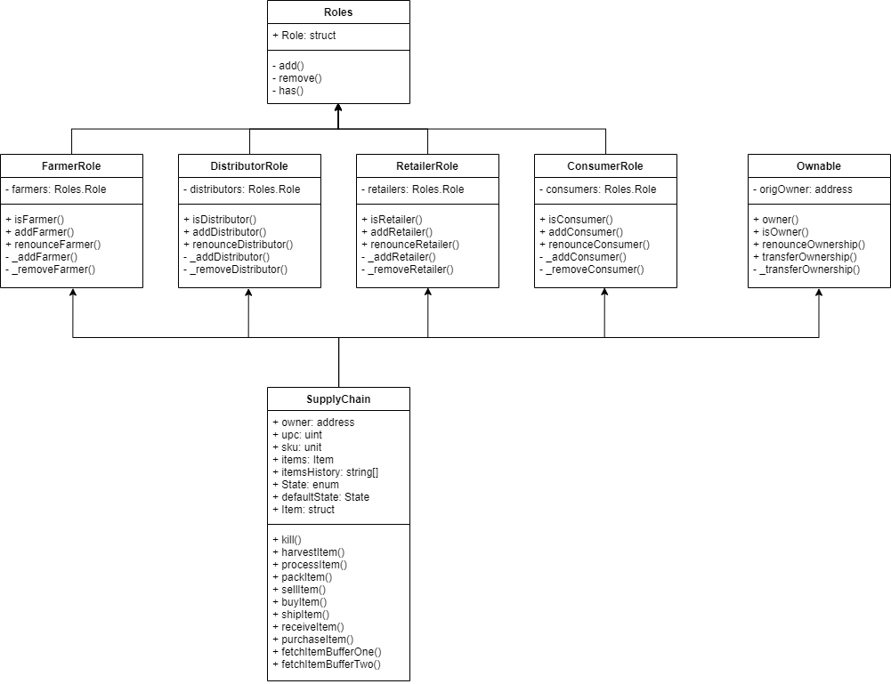

##Project: Ethereum Dapp for Tracking Items through Supply Chain

##Project write-up - UML
* Activity



* Sequence



* State



* Classes (Data Model)



##Project write-up - Libraries
Truffle v5.1.28 (core: 5.1.28)

Solidity - 0.4.24 (solc-js)

Node v10.15.3

Web3.js v1.2.1

truffle-assertions (^0.9.2)

truffle-hdwallet-provider (^1.0.17)

##General Write Up
Install dependencies:
````
npm install
````

Contract addresses deployed in Rinkeby test network:

| Contract Name | Contract Address|
|--------------:|:----------------|
|FarmerRole|https://rinkeby.etherscan.io/address/0x1BD2051b11302E657122c0b65a96C911230fCBA0#code|
|DistributorRole|https://rinkeby.etherscan.io/address/0xBFD7612A6F90FF1bC0b1157349d6DCE15bBDaCD7#code|
|RetailerRole|https://rinkeby.etherscan.io/address/0xB7aE552700096558F999eea99779ff13d6042A21#code|
|ConsumerRole|https://rinkeby.etherscan.io/address/0x43B0bc9121B7E3F9369E71963A74a966B46bDf86#code|
|SupplyChain|https://rinkeby.etherscan.io/address/0x86c0D379D5AbbE87562D3874137333ac6351650C#code|
